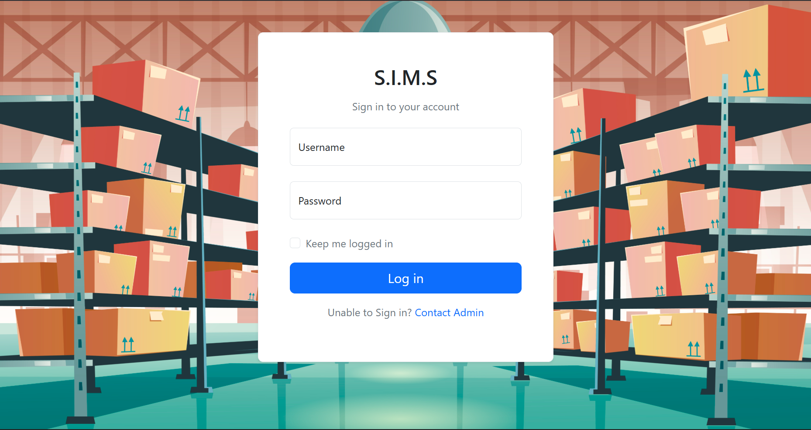
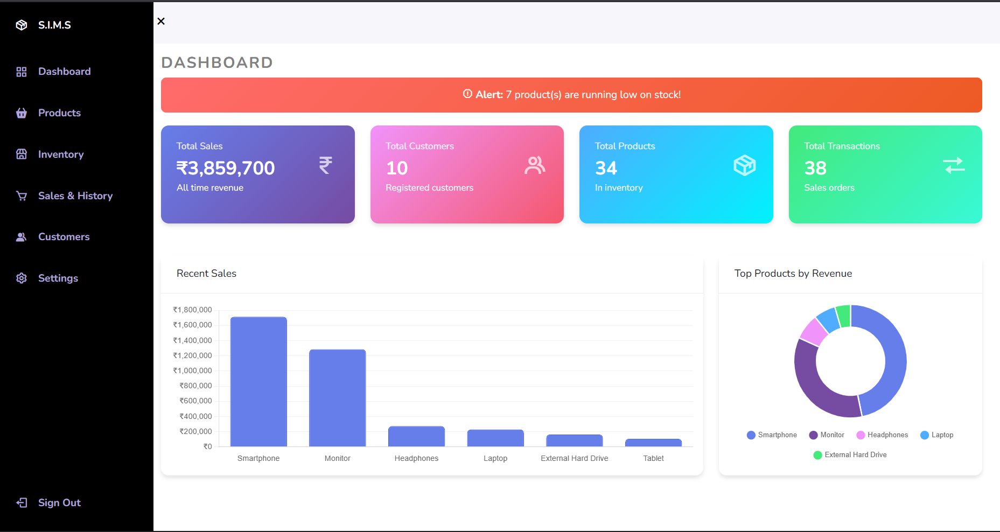
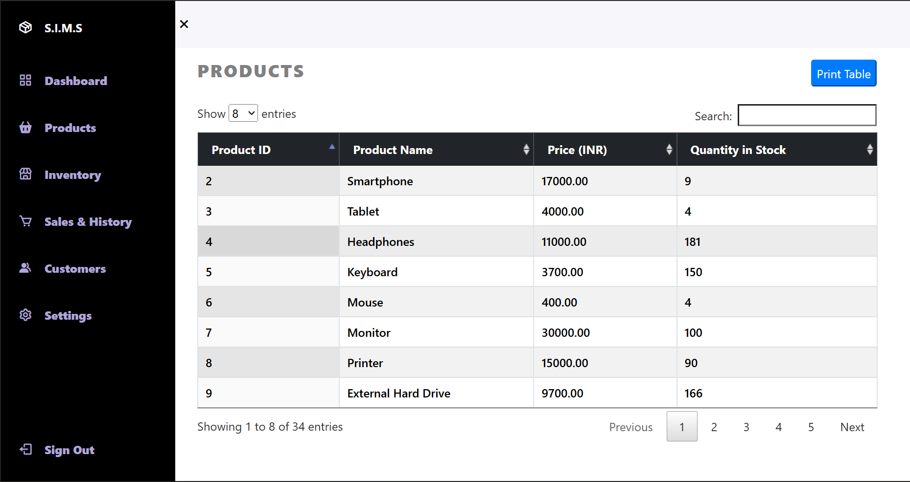
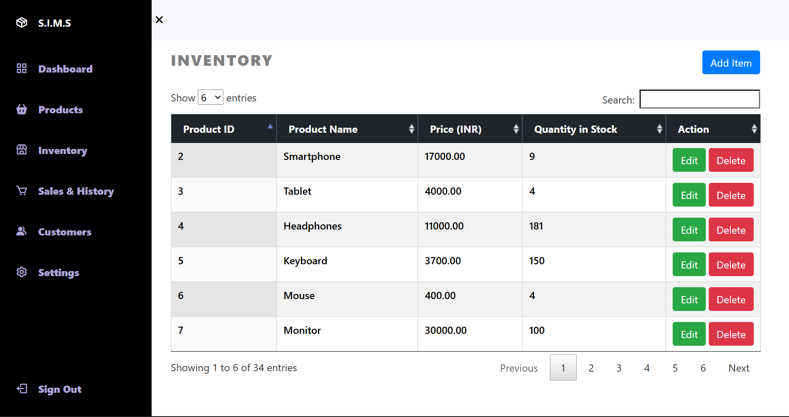
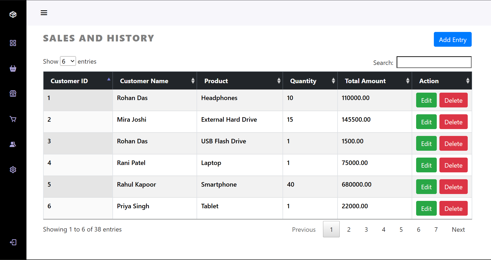
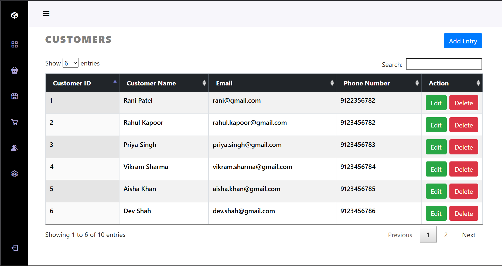
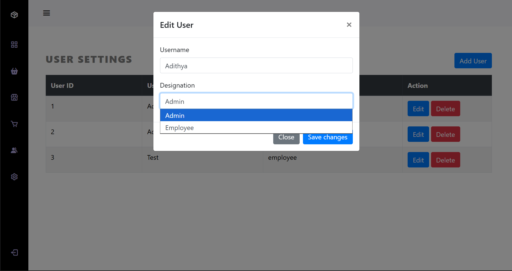
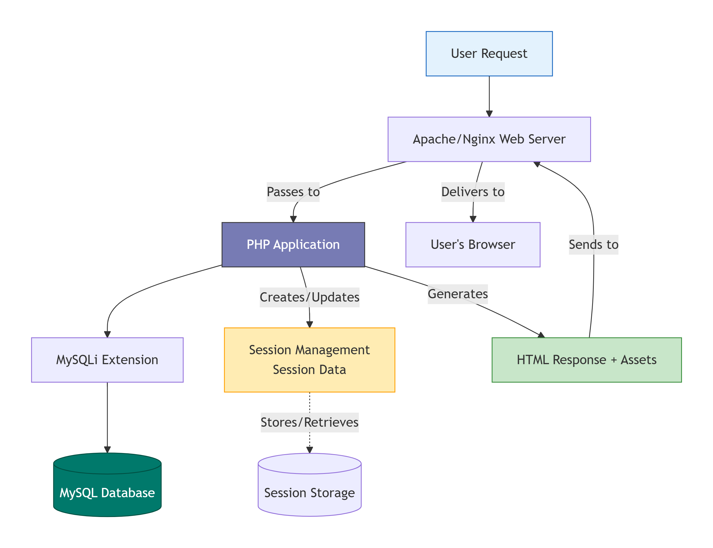

# Stock and Inventory Management System

A comprehensive web-based application designed to streamline inventory operations, sales tracking, and customer management for small to medium-sized businesses. Built with PHP and MySQL, this system provides an intuitive interface for managing products, processing transactions, and generating business insights through real-time analytics.

## Description

The Stock and Inventory Management System (SIMS) is a full-stack web application that addresses the critical challenge of manual inventory tracking and sales management faced by retail businesses and warehouses.

**Problem It Solves:**

- Eliminates manual spreadsheet-based inventory tracking
- Reduces human errors in stock management and sales calculations
- Provides real-time visibility into stock levels and sales performance
- Streamlines customer relationship management
- Enables data-driven business decisions through analytics dashboards

**Who It's For:**

- Small to medium-sized retail businesses
- Warehouse managers
- Store owners seeking to digitize operations
- Business administrators needing inventory oversight
- Sales teams requiring transaction management tools

## Screenshots

### Login Interface



*Secure authentication with role-based access control*

### Dashboard Overview



*Real-time analytics with interactive charts and key performance metrics*

### Product Catalog



*Comprehensive product listing with search and filter capabilities*

### Inventory Management



*Stock level monitoring with low-stock alerts and bulk operations*

### Sales Processing



*Transaction processing interface with order history*

### Customer Database



*Customer information management with purchase history tracking*

### System Settings



*Administrative panel for user management and system configuration*

## Features

### Core Functionality

- Real-time inventory tracking with automatic stock level updates
- Sales transaction processing with itemized billing
- Customer database with contact information and purchase history
- Role-based access control (Admin and Employee roles)
- Interactive analytics dashboard with charts and KPIs
- Low stock alerts and notifications
- Product catalog management with categories and pricing
- Sales history and revenue tracking
- Search and filter capabilities across all modules

### User Management

- Secure authentication system with session management
- Multiple user roles with permission-based access
- User profile management
- Activity logging and audit trails

### Reporting & Analytics

- Total products and inventory value metrics
- Sales performance tracking and revenue reports
- Customer analytics and purchase patterns
- Stock movement and reorder recommendations
- Visual data representation with Chart.js

### Data Operations

- Bulk product import/export capabilities
- Database backup and restore functionality
- Transaction history with detailed records
- Advanced search and filtering options

## System Architecture

The application follows a classic three-tier architecture pattern:

### Frontend Layer

- **Presentation:** HTML5, CSS3, and Bootstrap 5 for responsive UI
- **Client-side Logic:** Vanilla JavaScript and jQuery for DOM manipulation
- **Data Visualization:** Chart.js for rendering interactive graphs
- **Icons & UI Components:** Boxicons and Bootstrap components

### Backend Layer

- **Application Server:** PHP 7.4+ handling business logic
- **Request Processing:** Page-based routing system
- **Session Management:** PHP sessions for authentication state
- **Validation:** Server-side input validation and sanitization
- **Database Interface:** MySQLi extension for database operations

### Data Layer

- **Database:** MySQL 5.7+ for persistent data storage
- **Tables:** Users, Inventory, Customers, Transactions
- **Relationships:** Foreign key constraints ensuring data integrity
- **Security:** Prepared statements preventing SQL injection

### Architecture Flow



### Security Architecture

- Session-based authentication with timeout mechanisms
- Role-based access control enforced at page level
- SQL injection protection via prepared statements
- XSS prevention through input sanitization
- Password hashing for credential storage

## Technology Stack

### Frontend

- **HTML5** - Semantic markup and structure
- **CSS3** - Styling and responsive design
- **Bootstrap 5.3.3** - UI framework and component library
- **JavaScript (ES6)** - Client-side interactivity
- **jQuery 3.2.1** - DOM manipulation and AJAX
- **Chart.js** - Data visualization and charting
- **Boxicons** - Icon library
- **DataTables** - Enhanced table functionality

### Backend

- **PHP 7.4+** - Server-side scripting language
- **MySQLi** - MySQL improved extension for database connectivity
- **Session Management** - PHP native session handling

### Database

- **MySQL 5.7+** - Relational database management system
- **phpMyAdmin** - Database administration interface

### Development & Deployment

- **XAMPP** - Local development environment (Apache, MySQL, PHP)
- **Apache HTTP Server** - Web server
- **Git** - Version control system

### Tools & Libraries

- **Chrome DevTools** - Debugging and performance profiling
- **Visual Studio Code** - Code editor
- **Composer** - PHP dependency management (optional)

## Getting Started

### Prerequisites

Before installing the application, ensure your system meets the following requirements:

- PHP 7.4 or higher
- MySQL 5.7 or higher
- Apache Web Server 2.4+ or Nginx
- Web Browser (Chrome, Firefox, Safari, Edge - latest versions)
- Minimum 2GB RAM
- 500MB free disk space

### Installation

Follow these steps to set up the application on your local environment:

#### 1. Clone the Repository

```bash
git clone https://github.com/adithya-b-r/sims.git
cd sims
```

#### 2. Database Setup

**Option A: Using phpMyAdmin**

1. Open phpMyAdmin in your browser: `http://localhost/phpmyadmin`
2. Create a new database named `stocks-and-inventory`
3. Import the SQL file: Click Import → Choose file → Select `database/stocks-and-inventory.sql` → Click Go

**Option B: Using MySQL Command Line**

```bash
mysql -u root -p
```

```sql
CREATE DATABASE `stocks-and-inventory`;
USE `stocks-and-inventory`;
SOURCE /path/to/sims/database/stocks-and-inventory.sql;
EXIT;
```

#### 3. Configure Database Connection

Edit the `config.php` file with your database credentials:

```php
<?php
$db_host = 'localhost';       // Database host
$db_username = 'root';        // Your MySQL username
$db_password = '';            // Your MySQL password
$db_name = 'stocks-and-inventory'; // Database name
?>
```

#### 4. Deploy to Web Server

**For XAMPP Users:**

```bash
# Copy project to htdocs directory
cp -r sims /path/to/xampp/htdocs/
```

**For Manual Apache Setup:**

```bash
# Update Apache configuration to point to project directory
sudo nano /etc/apache2/sites-available/000-default.conf
# Set DocumentRoot to /path/to/sims
```

#### 5. Set File Permissions (Linux/Mac)

```bash
chmod 755 -R /path/to/sims/
chown -R www-data:www-data /path/to/sims/
```

#### 6. Start the Application

1. Start Apache and MySQL services:

   ```bash
   # XAMPP Control Panel (Windows/Mac)
   # Or via command line
   sudo service apache2 start
   sudo service mysql start
   ```

2. Access the application in your browser:

   ```
   http://localhost/sims
   ```

#### 7. Login with Default Credentials

**Administrator Account:**

```
Username: admin
Password: admin123
```

**Employee Account:**

```
Username: emp
Password: emp@123
```

### Post-Installation Steps

1. **Change Default Passwords:** Navigate to Settings and update admin credentials
2. **Configure User Accounts:** Add or modify users as needed
3. **Review Sample Data:** Explore pre-loaded products and customers
4. **Customize Settings:** Adjust system preferences to match your business needs

### Troubleshooting

**Database Connection Issues:**

```php
// Verify credentials in config.php
// Ensure MySQL service is running
// Check MySQL user has appropriate privileges
```

**Permission Errors:**

```bash
# Verify Apache has read/write permissions
ls -la /path/to/sims/
```

**Port Conflicts:**

```bash
# Check if port 80 is available
netstat -tuln | grep :80
# Change Apache port in httpd.conf if needed
```

## Security & Privacy

### Authentication & Authorization

- **Session-Based Authentication:** Secure PHP sessions with configurable timeout periods
- **Role-Based Access Control (RBAC):** Two-tier permission system (Admin/Employee)
- **Password Protection:** Credentials validated against database with secure comparison
- **Access Restrictions:** Page-level authorization checks preventing unauthorized access

### Data Protection

- **SQL Injection Prevention:** MySQLi prepared statements for all database queries
- **XSS Protection:** Input sanitization and output encoding on user-generated content
- **CSRF Protection:** Session token validation on critical operations
- **Secure Session Management:** HttpOnly and Secure flags on session cookies

### Environment Configuration

Create a `.env` file for sensitive configuration (recommended):

```env
# Database Configuration
DB_HOST=localhost
DB_USERNAME=root
DB_PASSWORD=your_secure_password
DB_NAME=stocks-and-inventory

# Session Configuration
SESSION_TIMEOUT=1800
SESSION_NAME=SIMS_SESSION

# Security Settings
HTTPS_ONLY=true
SECURE_COOKIES=true
```

### Best Practices Implemented

- Database credentials stored in separate configuration file
- No sensitive information logged or displayed in production
- Regular session regeneration on privilege changes
- Automatic logout after inactivity period
- Error messages sanitized to prevent information disclosure
- Database connection using least-privilege principle

### Recommended Security Measures

1. **SSL/TLS:** Deploy with HTTPS in production environments
2. **Database Users:** Create dedicated MySQL user with limited privileges
3. **Backup Strategy:** Implement automated database backups
4. **Updates:** Keep PHP, MySQL, and dependencies updated
5. **Monitoring:** Enable error logging and monitor for suspicious activity
6. **Password Policy:** Enforce strong passwords for admin accounts

## Future Enhancements

### Planned Features

- **Multi-Location Support:** Manage inventory across multiple warehouses or stores
- **Barcode Scanner Integration:** Quick product lookup and stock updates via barcode scanning
- **Email Notifications:** Automated alerts for low stock, sales reports, and system events
- **Advanced Reporting:** Customizable reports with PDF/Excel export functionality
- **Invoice Generation:** Automated invoice creation and printing for transactions
- **Supplier Management:** Track suppliers, purchase orders, and vendor relationships
- **Product Variants:** Support for product sizes, colors, and other attributes
- **RESTful API:** Enable integration with third-party systems and mobile apps
- **Mobile Application:** Native iOS and Android apps for on-the-go management

### Scalability Improvements

- **Database Optimization:** Implement indexing and query optimization for large datasets
- **Caching Layer:** Redis/Memcached integration for improved performance
- **Load Balancing:** Support for distributed architecture and horizontal scaling
- **Microservices Migration:** Decouple modules into independent services
- **Cloud Deployment:** Docker containerization and Kubernetes orchestration

### Performance & UX Upgrades

- **Progressive Web App (PWA):** Offline capability and app-like experience
- **Real-Time Updates:** WebSocket integration for live inventory changes
- **Advanced Search:** Elasticsearch integration for faster, more accurate searches
- **Dark Mode:** User preference-based theme switching
- **Accessibility:** WCAG 2.1 compliance for inclusive design
- **Internationalization:** Multi-language support for global businesses

### Analytics & Intelligence

- **Predictive Analytics:** ML-powered demand forecasting and reorder suggestions
- **Business Intelligence Dashboard:** Advanced metrics and trend analysis
- **Sales Forecasting:** Historical data analysis for inventory planning
- **Customer Insights:** Purchase behavior analysis and segmentation

## License

This project is licensed under the MIT License.

## Author

**Adithya B R**

- GitHub: [@adithya-b-r](https://github.com/adithya-b-r)
- Project Repository: [github.com/adithya-b-r/sims](https://github.com/adithya-b-r/sims)
- LinkedIn: [Connect with me](https://www.linkedin.com/in/adithya-br)

For questions, feedback, or collaboration opportunities, feel free to reach out through GitHub issues or discussions.

## Acknowledgements

### Frameworks & Libraries

- [Bootstrap](https://getbootstrap.com/) - Frontend UI framework
- [Chart.js](https://www.chartjs.org/) - JavaScript charting library
- [jQuery](https://jquery.com/) - JavaScript library for DOM manipulation
- [Boxicons](https://boxicons.com/) - High-quality web icons
- [DataTables](https://datatables.net/) - Advanced table plugin for jQuery

### Tools & Platforms

- [XAMPP](https://www.apachefriends.org/) - Cross-platform web server solution
- [phpMyAdmin](https://www.phpmyadmin.net/) - MySQL database administration tool
- [Visual Studio Code](https://code.visualstudio.com/) - Code editor

### Learning Resources

- [PHP Official Documentation](https://www.php.net/docs.php)
- [MySQL Documentation](https://dev.mysql.com/doc/)
- [MDN Web Docs](https://developer.mozilla.org/) - Web technology references

### Inspiration

- Various open-source inventory management systems
- Modern e-commerce and ERP platforms
- Community feedback and feature requests